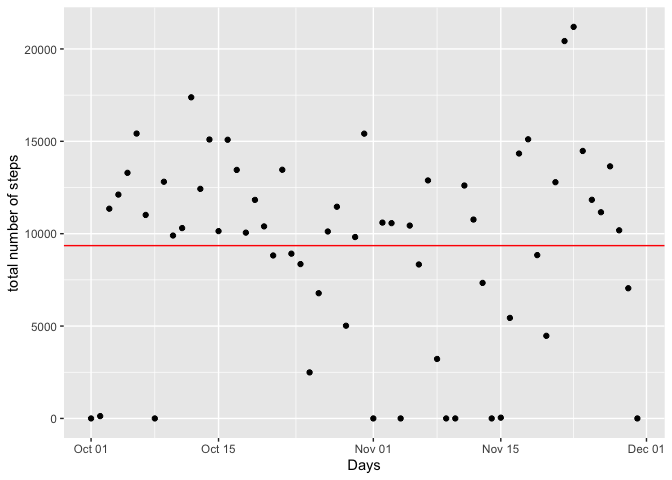
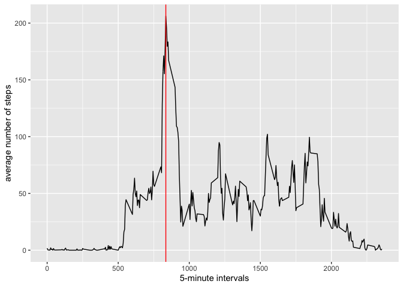
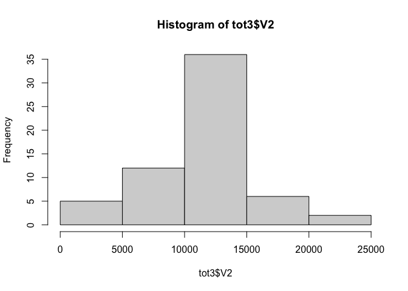
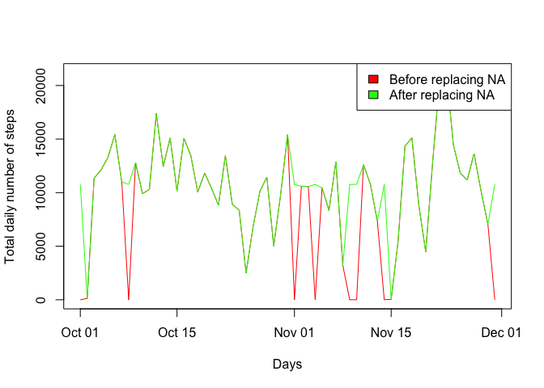
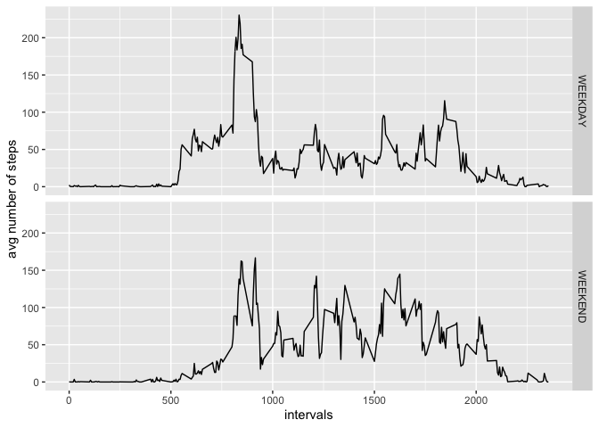

## Loading and preprocessing the data

### Loading libraries 

```r
library(ggplot2)
```

### Reading data  


```r
data <- read.csv(file="./activity.csv" , header= TRUE, sep=",", na.strings="NA",
                 colClasses = c("integer", "Date", "integer"))
```

We create two vectors containing the unique values of days and intervals


```r
days <- unique(data$date)
intervals <- unique(data$interval)
```

### What is mean total number of steps taken per day?

Let's create a data frame **tot** where we sum the number of steps for each day.


```r
tot <- data.frame()

for (i in 1:length(days)) {
  temp <- sum(data$steps[data$date %in% days[i]],na.rm=TRUE)
  tot[i,1] <- days[i]
  tot[i,2] <- temp
  rm(temp)
}

mn0 <- mean(tot$V2)
md0 <- median(tot$V2)

head(tot)
```

```
##           V1    V2
## 1 2012-10-01     0
## 2 2012-10-02   126
## 3 2012-10-03 11352
## 4 2012-10-04 12116
## 5 2012-10-05 13294
## 6 2012-10-06 15420
```

The results are displayed in the plot below:


```r
p0 <- ggplot(tot,aes(x=V1,y=V2))
p0 + geom_point()+xlab("Days")+ylab("total number of steps")+geom_hline(yintercept=mn0, col="red")
```

<!-- -->
 
The mean value is **9354.2295082** (displayed on the plot above) and the median value is **10395**.
  
### What is the average daily activity pattern?

Let's create a data frame **tot1** where we store the average number of steps for each interval.


```r
tot1 <- data.frame()

for (i in 1:length(intervals)) {
  temp <- mean(data$steps[data$interval %in% intervals[i]], na.rm=TRUE)
  tot1[i,1] <- intervals[i]
  tot1[i,2] <- temp
  rm(temp)
}
```

The results are displayed in the plot below.


```r
p1 <- ggplot(tot1,aes(x=V1,y=V2))
p1+geom_line()+ylab("average number of steps")+xlab("5-minute intervals")+geom_vline(xintercept=intervals[which.max(tot1$V2)],col="red")
```

<!-- -->

The interval **835** contains the maximum number of average steps.
  
### Imputing missing values

We create a data frame **tot2** where we replace all NA values by the interval mean.


```r
tot2 <- data

for (i in 1:length(tot2$steps)) {
  if (is.na(tot2$steps[i])) {
    index <- which(tot1$V1 ==tot2$interval[i] )
    tot2$steps[i] <- tot1$V2[index] 
  }
}

head(tot2)
```

```
##       steps       date interval
## 1 1.7169811 2012-10-01        0
## 2 0.3396226 2012-10-01        5
## 3 0.1320755 2012-10-01       10
## 4 0.1509434 2012-10-01       15
## 5 0.0754717 2012-10-01       20
## 6 2.0943396 2012-10-01       25
```

We create a new data frame **tot3** where we calculate the total number of steps per day. 
This follows the same approach as previously.


```r
tot3 <- data.frame()
for (i in 1:length(days)) {
  temp <- sum(tot2$steps[tot2$date %in% days[i]], na.rm=TRUE)
  tot3[i,1] <- days[i]
  tot3[i,2] <- temp
  rm(temp)
}

mn3 <- mean(tot3$V2)
md3 <- median(tot3$V2)
head(tot3)
```

```
##           V1       V2
## 1 2012-10-01 10766.19
## 2 2012-10-02   126.00
## 3 2012-10-03 11352.00
## 4 2012-10-04 12116.00
## 5 2012-10-05 13294.00
## 6 2012-10-06 15420.00
```

The histogram below shows the total number of steps taken each day, after replacing the missing values by the interval mean: 


```r
hist(tot3$V2)
```

<!-- -->

Finally, we compare the total daily number of steps before and after filling the missing values:


```r
plot(x=tot$V1, y=tot$V2, type="l", col="red", xlab="Days", ylab="Total daily number of steps")
lines(x=tot3$V1, y=tot3$V2, type="l", col="green")
legend("topright", legend=c("Before replacing NA", "After replacing NA"), fill=c("red","green"),col=c("red","green"))
```

<!-- -->

### Are there differences in activity patterns between weekdays and weekends?

We create a data frame **tot4** that will contain the activity pattern for weekdays and weekends separately.


```r
tot4 <- data.frame()

for (i in 1:length(intervals)) {
  temp <- tot2[tot2$interval %in% intervals[i] & (weekdays(tot2$date) =="Saturday" | weekdays(tot2$date) =="Sunday"),]
  tot4 <- rbind(tot4,c(intervals[i],mean(temp$steps,na.rm = TRUE),"WEEKEND"))
  temp <- tot2[tot2$interval %in% intervals[i] & !weekdays(tot2$date) =="Saturday" & !weekdays(tot2$date) =="Sunday",]
  tot4 <- rbind(tot4,c(intervals[i],mean(temp$steps,na.rm = TRUE),"WEEKDAY"))
  rm(temp)
}
names(tot4) <- c("interval", "avg.steps", "type")

head(tot4)
```

```
##   interval          avg.steps    type
## 1        0  0.214622641509434 WEEKEND
## 2        0   2.25115303983228 WEEKDAY
## 3        5 0.0424528301886792 WEEKEND
## 4        5  0.445283018867925 WEEKDAY
## 5       10 0.0165094339622642 WEEKEND
## 6       10  0.173165618448637 WEEKDAY
```

Here is a plot comparing the average number of steps during weekdays and weekends, per intervals:


```r
qplot(as.numeric(interval),as.numeric(avg.steps),data=tot4, facets=type~.,
      xlab="intervals",
      ylab="avg number of steps",
      geom="line"
      )
```

<!-- -->
